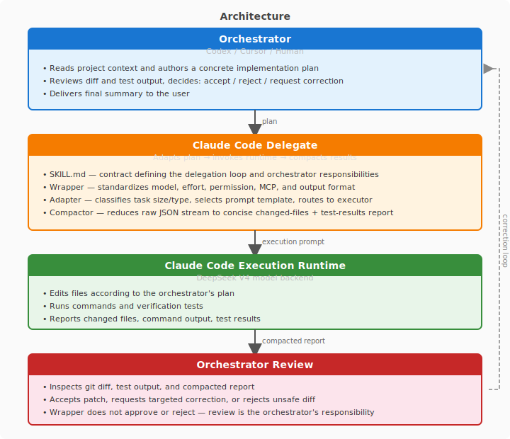

# Claude Code Delegate

> Codex 做架构师，Claude Code 做运行时，DeepSeek V4 做低成本模型后端。

Claude Code Delegate 是一个面向编排器驱动 AI 编码工作流的受控委派层。编排器（Codex、Cursor 或其他 AI）负责规划和审查；本工具格式化计划、调用 Claude Code 作为执行运行时（默认使用 DeepSeek V4 后端）、压缩结果并返回给编排器审查。wrapper 不会批准或拒绝变更——那是编排器的职责。

## 这个项目是什么 / 不是什么

| 这个项目是... | 这个项目不是... |
|---|---|
| Codex/Cursor 驱动工作流的受控委派层 | 全自主编码 agent |
| 标准化 model、effort、permission、MCP 和输出的轻量 wrapper | "Claude Code 接 DeepSeek"——模型后端可替换 |
| 将规划（编排器）与执行（Claude Code 运行时）分离的工具集 | 编排器规划和审查角色的替代品 |
| 为编排器返回简洁报告的压缩器 | 审批系统——wrapper 不接受或拒绝变更 |

## 为什么不直接用 Claude Code + DeepSeek？

你可以直接用 Claude Code 连接任何 provider：

```bash
claude -p "fix the type error in src/cli.py" --model deepseek-v4-flash[1m]
```

直接调用适合单条命令、快速检查、交互式调试。wrapper 在以下场景提供额外价值：

- **标准化标志**：每次调用统一设置 model、effort、permission mode、MCP config 和 output mode，不会出现标志漂移。
- **任务分类**：适配器自动对每个 prompt 分类（tiny 只读、routine 编辑、debugging、architecture），选择合适的模型层级和 effort 级别。
- **输出压缩**：原始 Claude Code JSON 流被压缩为简洁报告（变更文件、命令结果、测试输出、错误），编排器无需解析流式 JSON。
- **安全默认值**：子 agent 默认禁用，防止静默递归。心跳信号确认长时间任务仍在运行。
- **画像元数据**：每次委派记录 model、effort、token 用量和费用，用于趋势分析。

快速问答用 `claude -p`。需要一致、可审查的委派和标准化输出时使用 wrapper。

## 概览

Claude Code Delegate **不是**全自主编码 agent。编排器编写计划并审查结果；wrapper 不批准变更。

本项目将工作流分为两个角色，而不是让一个 agent 规划、修改文件并批准自己的工作：

- **编排器**——Codex、Cursor 或其他高级 agent，负责规划和审查。
- **执行运行时**——以 DeepSeek V4 为模型后端的 Claude Code，专注于实现。



工作流程：

1. **Plan**——编排器读取项目上下文，生成包含所有权边界和验证命令的具体实施计划。
2. **Delegate**——适配器对任务分类，选择 prompt 封套，应用 model/effort/permission/output 设置。wrapper 以一致的标志调用 Claude Code。
3. **Execute**——Claude Code 使用配置的模型后端（默认 DeepSeek V4）执行实现。编辑文件、运行命令、生成测试。
4. **Compact**——wrapper 捕获 Claude Code 的 JSON 输出，通过 `compact-claude-stream.py` 压缩为简洁报告：变更文件、命令输出、测试结果、错误和执行元数据。wrapper **不**批准或拒绝变更。
5. **Review**——编排器检查 `git diff`、测试输出和压缩报告，决定接受、拒绝或请求定向修正。
6. **Report**——编排器给出最终摘要：变更内容、测试运行情况、剩余风险。

你可以通过[软链接到 Codex skill 目录](#作为-codex-skill-使用)使用本项目，也可以[作为独立编排器](#作为独立编排器使用)直接调用脚本。

## 组件

| 文件 | 用途 |
|------|------|
| `SKILL.md` | 编排器契约——定义委派循环、解析器和编排器职责 |
| `scripts/run-claude-code.sh` | Wrapper——标准化 model、effort、permission mode、MCP config 和输出格式 |
| `scripts/delegation-adapter.py` | 适配器——分类任务大小/类型、选择 prompt 模板、设置路由参数 |
| `scripts/classifier.py` | 分类器——提取自 delegation-adapter，纯函数 classify_prompt() |
| `scripts/envelope_builder.py` | 封套构建器——提取自 delegation-adapter，为 prompt 包装任务模板 |
| `scripts/invoker.py` | 调用器——启动 claude -p 子进程，处理 MCP 配置、心跳、输出捕获 |
| `scripts/compact-claude-stream.py` | 压缩器——将原始 JSON 流压缩为面向编排器的简洁报告（含 parse_compact_output()） |
| `scripts/aggregate-profile-log.py` | 画像聚合器——读取 CLAUDE_DELEGATE_PROFILE_LOG JSONL 并生成摘要 |
| `scripts/profile_logger.py` | 画像日志——提取自 compact-claude-stream，提供 append_profile_record() |
| `scripts/jira-safe-text.py` | Jira 格式化器——剥离 Markdown 用于 Jira MCP 纯文本评论 |
| `scripts/mcp_server.py` | MCP 服务器——通过 stdio JSON-RPC 暴露委派工具（classify、delegate、aggregate、format_jira_text） |
| `tests/run_tests.sh` | 测试运行器——覆盖 wrapper 标志解析、适配器分类、压缩器行为、invoker、MCP 服务器 |
| `docs/jira-workflow.md` | Jira 委派约定 |
| `docs/adr/` | 架构决策记录 |

## 运行模式

### 权限模式

wrapper 支持三种权限模式，对应不同信任级别：

| 模式 | 标志 | 权限设置 | 适用场景 |
|------|------|---------|----------|
| 安全首次运行 | `--interactive` | `acceptEdits`——自动接受文件编辑，工具命令需确认 | 首次使用、调试或需要审查命令时 |
| 受控委派 | *(默认)* | `bypassPermissions`——完全非交互 | 正常无头委派，编排器事后审查结果 |
| 自动化模式 | `--bypass` | `bypassPermissions`——同默认，显式别名 | CI/CD 流水线、可信仓库、脚本 |

> **⚠️ 审查提醒**：权限模式只控制 Claude Code 执行过程中是否弹出确认。wrapper 从不批准或拒绝变更——那是编排器的职责。无论什么权限模式，接受委派工作前务必检查 `git diff` 和测试输出。

### MCP 传输

`scripts/mcp_server.py` 通过 stdio JSON-RPC 将委派暴露为 MCP 服务器。支持 MCP 的主机可以通过 `tools/list` 发现四个工具，并通过类型化 JSON-RPC 调用。需要 `pip install mcp`。Shell wrapper 仍是主传输通道，不需要 `mcp` 包——MCP 服务器是为支持 MCP 的编排器新增的发现层。

`.mcp.json` 配置示例（请勿创建真实文件）：

```json
{
  "mcpServers": {
    "claude-code-delegate": {
      "command": "python3",
      "args": ["scripts/mcp_server.py"]
    }
  }
}
```

### MCP 工具

| 工具 | 功能 |
|------|------|
| `classify_task` | 将 prompt 按大小、类型、模型层级、effort、权限模式和上下文预算分类 |
| `delegate_task` | 完整委派管线：分类→封套→调用→压缩→返回含 usage 和 cost 的结构化结果 |
| `aggregate_profile` | 将 CLAUDE_DELEGATE_PROFILE_LOG JSONL 聚合为文本或 JSON 摘要 |
| `format_jira_text` | 将 Markdown 转换为 Jira 安全的纯文本 |

### MCP vs Shell Wrapper

| 维度 | Shell Wrapper | MCP 传输 |
|------|--------------|---------|
| 发现 | 编排器必须知道解析器路径 | MCP 客户端通过 `tools/list` 发现 |
| 契约 | CLI 标志和退出码 | 类型化 JSON-RPC 请求/响应，结构化错误 |
| 错误 | 退出码 + stderr | 标准错误码的 JSON-RPC 错误对象 |
| 调用 | `"$(resolve_delegator)" "$PROMPT"` | `tools/call` 带类型参数 |
| 依赖 | bash + python3 | 需要 `pip install mcp` |

Shell wrapper 仍是主传输通道，不需要 `mcp` 包。MCP 服务器是附加层——当有 MCP 主机时，它提供类型化发现和结构化响应，不改变 shell wrapper 接口。

## 快速上手

```bash
# 1. 克隆
git clone https://github.com/DongL/claude-code-delegate.git
cd claude-code-delegate

# 2. 前提条件：已安装 Claude Code 且有 python3
claude --version
python3 --version

# 3.（推荐）软链接到 Codex skill 目录
# 推荐（当前 Codex 路径）
mkdir -p ~/.agents/skills
ln -sfn "$PWD" ~/.agents/skills/claude-code-delegate

# 旧版 Codex 路径（仅当你的 Codex 版本仍使用它）
mkdir -p ~/.codex/skills
ln -sfn "$PWD" ~/.codex/skills/claude-code-delegate

# 4. 运行测试套件验证
bash tests/run_tests.sh

# 5. 尝试一个最小委派（安全交互模式）
./scripts/run-claude-code.sh --interactive --flash "hello from delegate"

# 6.（可选）如需 MCP 主机发现，将服务器添加到 .mcp.json——
# 配置片段见运行模式中的 MCP 传输部分。
```

## Provider 配置

本项目默认使用 DeepSeek V4 模型。在运行 wrapper 之前，需要配置 Claude Code 使用 DeepSeek 作为模型后端。两种方式：

### 方式 A：环境变量（推荐）

在 shell 配置文件（`.zshrc`、`.bashrc`）中设置，或在每次会话前设置：

```bash
export ANTHROPIC_BASE_URL=https://api.deepseek.com/anthropic
export ANTHROPIC_AUTH_TOKEN=<你的 DeepSeek API key>
export ANTHROPIC_MODEL=deepseek-v4-pro[1m]
export ANTHROPIC_DEFAULT_OPUS_MODEL=deepseek-v4-pro[1m]
export ANTHROPIC_DEFAULT_SONNET_MODEL=deepseek-v4-pro[1m]
export ANTHROPIC_DEFAULT_HAIKU_MODEL=deepseek-v4-flash[1m]
export CLAUDE_CODE_SUBAGENT_MODEL=deepseek-v4-flash[1m]
export CLAUDE_CODE_EFFORT_LEVEL=max
```

在 [platform.deepseek.com/api_keys](https://platform.deepseek.com/api_keys) 获取 API key。

验证是否可用：

```bash
claude -p "hello" --model deepseek-v4-flash[1m]
```

### 方式 B：cc-switch（GUI）

[cc-switch](https://github.com/farion1231/cc-switch) 是一个跨平台桌面应用，管理 Claude Code、Codex 和其他 AI 工具的 provider 配置。内置 50+ 个 provider 预设，包括 DeepSeek——无需手动设置环境变量。安装后从 provider 列表选择 DeepSeek 并点击激活即可。

> **注意**：模型名称和 provider URL 因 Claude Code provider 适配器或代理（cc-switch、OpenRouter、自定义端点等）而异。如果 `claude -p "hello" --model deepseek-v4-flash[1m]` 失败，请先调试 provider 配置再怀疑 wrapper 有问题。wrapper 原样传递模型名称，不翻译或重新映射模型标识符。

---

## 实战示例

```bash
# 修复 README 拼写错误
./scripts/run-claude-code.sh --interactive "fix the typo 'Recieve' to 'Receive' in README.md"

# 为已有函数添加单元测试
./scripts/run-claude-code.sh --interactive "add a unit test for the parse_args() function in src/cli.py"

# 审查 PR diff 并提出改进建议
./scripts/run-claude-code.sh --interactive "review git diff HEAD~1 and report issues"
```

## 使用方式

### 作为 Codex Skill 使用

将项目软链接到 Codex skill 目录，Codex 发现 `SKILL.md` 后即可调用委派循环：

```bash
# 推荐（当前 Codex 路径）
mkdir -p ~/.agents/skills
ln -sfn "$PWD" ~/.agents/skills/claude-code-delegate

# 旧版 Codex 路径（仅当你的 Codex 版本仍使用它）
mkdir -p ~/.codex/skills
ln -sfn "$PWD" ~/.codex/skills/claude-code-delegate
```

`SKILL.md` 中的解析器按以下顺序查找 wrapper 脚本：

1. `$CLAUDE_DELEGATE_DIR`（显式覆盖——设置此项可使用非默认安装路径）
2. `$HOME/.agents/skills/claude-code-delegate`（当前 Codex 路径）
3. `$HOME/.codex/skills/claude-code-delegate`（旧版 Codex 路径）

无需配置 shell profile——解析器使首次运行无需环境变量。

### 作为独立编排器使用

任何 AI 或人类都可以通过阅读 `SKILL.md` 并直接调用 wrapper 来充当编排器：

```bash
./scripts/run-claude-code.sh --interactive "implement this feature"
```

或指定项目根目录（当从不同工作目录运行时很有用）：

```bash
CLAUDE_DELEGATE_DIR=/path/to/claude-code-delegate \
  ./scripts/run-claude-code.sh --interactive "implement this feature"
```

编排器负责循环：plan → delegate → review → correct → report。`SKILL.md` 作为定义每一步的契约。

## CLI 用法

```bash
# 安全首次运行——自动接受文件编辑，工具命令需确认（推荐）
./scripts/run-claude-code.sh --interactive "你的 prompt"

# 默认（pro 模型、quiet 输出、非交互 bypass）
./scripts/run-claude-code.sh "你的 prompt"

# Flash 模型
./scripts/run-claude-code.sh --flash "你的 prompt"

# 覆盖单次调用的 effort 级别
./scripts/run-claude-code.sh --effort max "你的 prompt"

# 流式输出（调试用）
./scripts/run-claude-code.sh --stream "你的 prompt"

# 自动化模式——完全非交互，无权限提示（CI / 可信仓库）
./scripts/run-claude-code.sh --bypass "你的 prompt"

# 禁用项目/用户 MCP 服务器，仅执行实现任务
./scripts/run-claude-code.sh --mcp none "你的 prompt"

# 从 .mcp.json 仅加载 Jira MCP
./scripts/run-claude-code.sh --mcp jira "update the issue status"

# 调试时禁用 prompt 适配
./scripts/run-claude-code.sh --full-context "你的 prompt"

# 允许 Claude Code 在本次调用中生成子 agent
./scripts/run-claude-code.sh --allow-subagents "你的 prompt"

# 环境变量覆盖
CLAUDE_DELEGATE_MODEL='deepseek-v4-flash[1m]' \
CLAUDE_DELEGATE_EFFORT=medium \
CLAUDE_DELEGATE_PERMISSION_MODE=bypassPermissions \
CLAUDE_DELEGATE_MCP_MODE=none \
CLAUDE_DELEGATE_CONTEXT_MODE=full \
CLAUDE_DELEGATE_SUBAGENTS=on \
CLAUDE_DELEGATE_HEARTBEAT_SECONDS=15 \
CLAUDE_DELEGATE_PROFILE_LOG=logs/delegation-profile.jsonl \
  ./scripts/run-claude-code.sh "你的 prompt"
```

详见 [SECURITY.md](SECURITY.md) 了解权限模式、风险和信任层级的详细说明。

当被编排器使用时，`SKILL.md` 提供 `resolve_delegator` 辅助函数，在多个安装路径中查找 wrapper 脚本。详见 `SKILL.md` 中的完整解析器定义。

MCP 模式默认为 `all`，保留 Claude Code 正常的 MCP 发现。`--mcp none` 使用严格的空 MCP 配置，`--mcp jira`、`--mcp linear`、`--mcp sequential-thinking` 仅从 `.mcp.json` 或 `CLAUDE_DELEGATE_MCP_CONFIG_PATH` 加载指定的服务器。

wrapper 在调用前对任务分类。Tiny 只读检查使用 flash/low effort/minimal 上下文，routine 编辑和 Jira 操作用 flash/medium effort，debugging 用 pro/high effort，architecture 工作用 pro/max effort，未知 prompt 回退到原始完整 prompt + pro/max。已知任务模板保留完整原始请求；wrapper 不会截断执行上下文来节省 Claude Code 端的 token。压缩输出显示选中的 class、task type、context budget、prompt template、token 用量、费用和可选的 JSONL 画像元数据。

子 agent 默认通过 `--disallowedTools Task Agent` 禁用，防止委派执行器在 quiet 模式缓冲输出时静默生成另一个本地 agent。Quiet 模式立即向 stderr 写入心跳，并每 30 秒更新一次；设置 `CLAUDE_DELEGATE_HEARTBEAT_SECONDS=0` 可禁用。

## 画像分析

设置 `CLAUDE_DELEGATE_PROFILE_LOG` 在每次委派后将画像元数据追加到 JSONL 文件。每条记录包含 model、effort、task type、token 用量、缓存命中数据、费用和 prompt 字符统计。附带的 `scripts/aggregate-profile-log.py` 读取这些日志并生成简洁的聚合摘要：

```bash
# 启用画像
export CLAUDE_DELEGATE_PROFILE_LOG=logs/delegation-profile.jsonl
./scripts/run-claude-code.sh --flash "你的 prompt"

# 聚合分析（纯文本，默认）
python3 scripts/aggregate-profile-log.py "$CLAUDE_DELEGATE_PROFILE_LOG"

# 机器可读 JSON 输出
python3 scripts/aggregate-profile-log.py --json "$CLAUDE_DELEGATE_PROFILE_LOG"

# 或直接传入路径
python3 scripts/aggregate-profile-log.py logs/delegation-profile.jsonl
```

## 任务分类

wrapper 使用确定性任务分类（无显式 model/effort/permission 覆盖时）：

| 类别 | 典型任务 | 模型 | Effort | 上下文 |
|------|---------|------|--------|--------|
| `tiny` | 只读检查、计数、列表 | flash | low | minimal |
| `small` | routine 编辑或 Jira 操作 | flash | medium | standard |
| `medium` | 调试、traceback、回归修复 | pro | high | standard |
| `large` | 架构、重构、迁移、ADR 工作 | pro | max | expanded |
| `default` | 未知/模糊任务 | pro | max | 完整 prompt |

显式标志和环境变量覆盖分类：

```bash
"$(resolve_delegator)" --flash --effort medium "$PROMPT"
CLAUDE_DELEGATE_EFFORT=max "$(resolve_delegator)" "$PROMPT"
```

### Karpathy 编码准则

所有 prompt 模板自动包含以下编码准则（内联在 `scripts/envelope_builder.py` 中）：

- 做外科手术式变更。不引入任务范围外的功能、重构或抽象。
- 偏爱无聊、简单的代码。三行相似代码好过一次过早抽象。
- 显式声明假设。如果某件事不显而易见，说明原因。
- 开始前定义可验证的成功标准。用测试或命令验证。
- 默认不写注释。只在原因不显而易见时才加一行。
- 不为不可能发生的场景添加错误处理或验证。
- 不为假设的未来需求设计。不写半成品实现。

## Pro vs Flash

DeepSeek V4 模型家族的两个能力层级：

| 维度 | Pro | Flash |
|------|-----|-------|
| 参数 | 1.6T 总量 / 49B 活跃 | 284B 总量 / 13B 活跃 |
| 用途 | 高难度推理、架构、调试 | 快速、低成本、routine 编码 |
| 上下文 | 1M tokens | 1M tokens |
| Thinking | 支持 | 支持 |
| 费用 | 较高 | 较低 |

`[1m]` 后缀是 1M token 上下文窗口的路由标签，不是能力层级。Thinking 预算（`--effort`）与模型层级正交——Flash 上的 `effort=max` 不等于 Pro 的能力。

## 环境变量参考

```bash
CLAUDE_DELEGATE_MODEL=deepseek-v4-pro[1m]     # 模型覆盖
CLAUDE_DELEGATE_EFFORT=max                     # effort 覆盖
CLAUDE_DELEGATE_THINKING_TOKENS=0              # 显式 thinking 预算（默认不设）
CLAUDE_DELEGATE_OUTPUT_MODE=stream             # 输出模式（quiet/stream）
CLAUDE_DELEGATE_PERMISSION_MODE=acceptEdits    # 权限模式
CLAUDE_DELEGATE_MCP_MODE=none                  # MCP 模式（all/none/jira/linear/sequential-thinking）
CLAUDE_DELEGATE_CONTEXT_MODE=full              # 上下文模式（auto/full）
CLAUDE_DELEGATE_SUBAGENTS=on                   # 子 agent（on/off）
CLAUDE_DELEGATE_HEARTBEAT_SECONDS=15           # 心跳间隔（0 禁用）
CLAUDE_DELEGATE_PROFILE_LOG=logs/profile.jsonl # 画像日志路径
CLAUDE_DELEGATE_DIR=/path/to/project           # wrapper 解析器显式路径
CLAUDE_DELEGATE_MCP_CONFIG_PATH=/path/.mcp.json # 单服务器模式的 MCP 配置路径
```

## 项目要求

- 已安装并配置 [Claude Code](https://docs.anthropic.com/en/docs/claude-code/overview)
- 可访问 Claude Code 兼容的模型
- 用于 JSON 压缩器的 `python3`
- （可选）MCP 服务器需要 `pip install mcp`

## 许可

MIT
